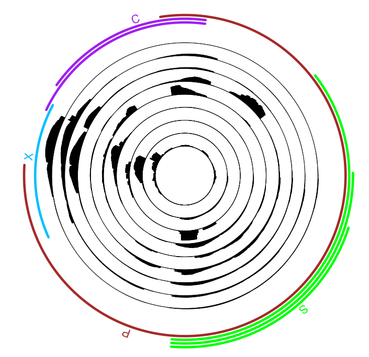

# HBV scRNA-seq
Tools for HBV expression and genome distribution analysis from single cell RNA-seq data (10x Chromium Single Cell 5'/3' Reagent Kit)

## Environment required
python 3.9

R (v4.2.0) with 'circlize' package

bwa 0.7.17

samtools 1.15

## Usage:
### 1, mapping reads to HBV CDS genome (NC_003977.2)
> bwa mem CDS/HBV_CDS.fa sample_R2.fastq.gz | samtools view -F 4 -bS -o sample.bam

### 2, parsing alignment recodes from bam file
> HBV_parsing.py --bed CDS/hbv_cds.bed --read1 sample_R1.fastq.gz --bam sample.bam --out sample.align.txt --sample samplename

Using '--celltype_file celltype.txt' if celltype is defined in 'celltype.txt' and "sample_name\tbarcode\tcelltype" in header.

output format, including 12 columns:
> 'sample': sample name from '--sample'
>
> 'readname': readname from fastq file
>
> 'chr': read mapping chromosome
>
> 'start': read mapping start
>
> 'end': read mapping end
>
> 'seq': read mapping read sequence
>
> 'left_clip': read left clipped sequence, empty if no left soft clip.
>
> 'right_clip': read right clipped sequence, empty if no left soft clip.
>
> 'cell_barcode': cell barcode from read 1 fastq, default 16bp 
>
> 'umi': unique molecular index sequence from read 1 fastq
>
> 'adjust_cell_barcode': cell barcode adjust sequence by celltype.txt or empty
>
> 'celltype': celltype from celltype.txt file, or empty

### 3, drawing HBV expression and genome distribution figure
> circos_plot.R --bed CDS/hbv_cds.bed --input sample.align.txt --outfile sample.pdf

if you want ploting multiple samples in one figure, gather '*.align.txt' in one file and use 'circos_plot.R' as same as above.

## example figure

